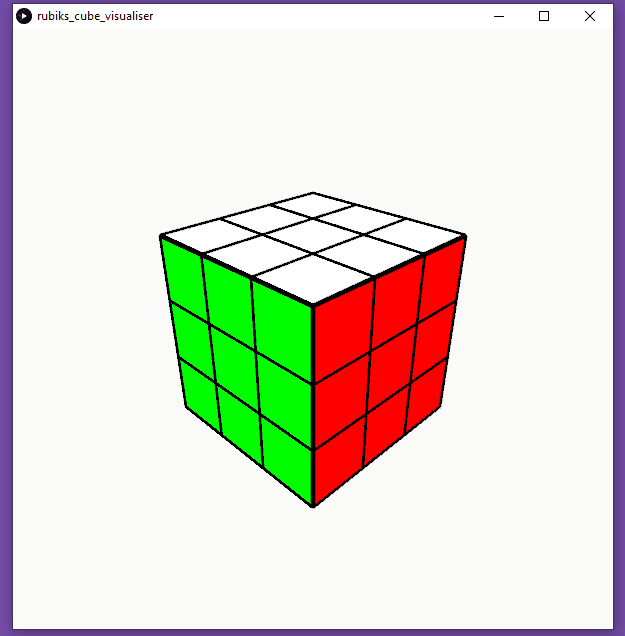

# rubiks-cube-visualiser

This project allows a user to play around with a rubiks cube that is being drawn on their screen. This 
project uses [Processing](https://processing.org/) to draw the cube to the screen. 

### Instructions/Controls

|               | Clockwise     | Counter-clockwise  |
| ------------- |:-------------:| -----:|
| Front         | F             | f     |
| Back          | B             | b     |
| Top           | U             | u     |
| Bottom        | D             | d     |
| Right         | R             | r     |
| Left          | L             | l     |
|               |               |       |
| Scramble      | Space bar     |       |
| Solve         | Enter/Return  |       |

